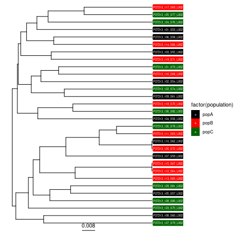
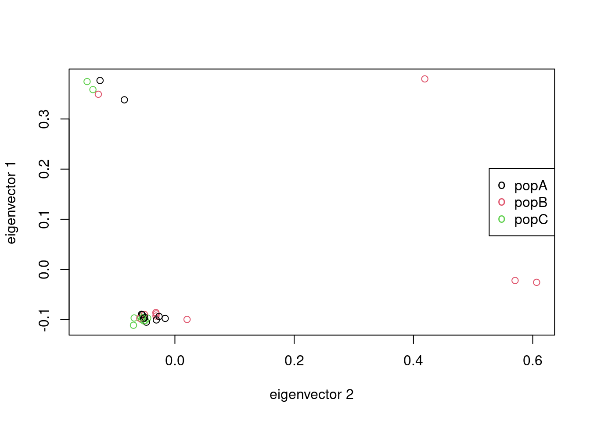
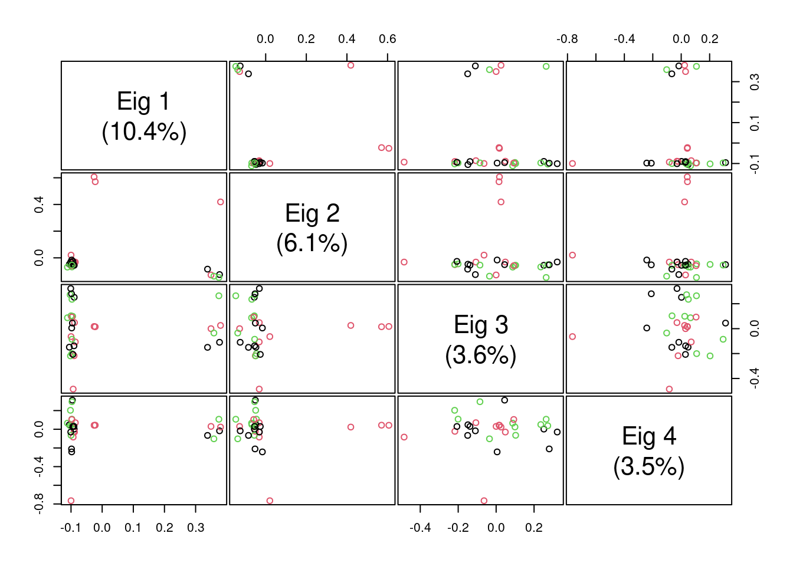

# NRM SNV Mosses workflow

- Last modified: tis apr 25, 2023  08:03
- Sign: Johan Nylander

## Workflow repository

<https://github.com/Naturhistoriska/NRM-SNV-Mosses-workflow>

## Software requirements

All analyses was run on the Linux operating system (Ubuntu 20.04, bash v.5.0.17).

Specific software used (with versions):

- `R` 4.3.0
- R library `SNPRelate` 1.33.2
- R library `ape` 5.7
- R library `gdsfmt` 1.35.9
- R library `ggtree` 3.7.2
- R library `tidyverse` 2.0.0
- `bcftools` 1.10.2
- `bwa` 0.7.17
- `freebayes` 1.3.6
- `nextflow` 23.04.0
- `nf-core` 2.7.2
- `samtools` 1.10
- `vcftools` 0.1.16

## Data backup

Data delivery from [NGI](https://www.scilifelab.se/units/ngi/) is currently
deposited (non-public) at
`nrmdna01.nrm.se:/projects/BOT-projects/larshede/ngisthlm00062`.

## Fastq filtering and Mapping

Set up directories

    $ mkdir -p /home/$USER/run/snv/eager/{data,reference}
    $ cd /home/$USER/run/snv/eager

Reference (genome) from
<https://www.ncbi.nlm.nih.gov/data-hub/genome/GCA_006891605.1/>

    $ wget -O ref.fasta.gz \ 
      "https://ftp.ncbi.nlm.nih.gov/genomes/all/GCA/006/891/605/GCA_006891605.1_SU_Pschr_1.0/GCA_006891605.1_SU_Pschr_1.0_genomic.fna.gz"
    $ gunzip ref.fasta.gz
    $ samtools faidx ref.fasta

Input data as fastq.gz files

    $ cd /home/$USER/run/snv/eager/data
    $ find /home/$USER/run/snv/data/P27213 -name '*_001.fastq.gz' -exec ln -s {} . \;
    $ cd /home/$USER/run/snv/eager

Eager parameters (different from default) in file `nf-params.json`:

    $ cat nf-params.json
    {
        "input": "data/*_{R1,R2}_*.fastq.gz",
        "fasta": "reference/ref.fasta",
        "fasta_index": "reference/ref.fasta.fai",
        "skip_damage_calculation": true,
        "mergedonly": true,
        "mapper": "bwamem"
    }

Start eager pipeline

    $ screen -S eager
    $ cd /home/$USER/run/snv/eager
    $ mkdir -p /home/$USER/run/snv/eager/singularity
    $ export NXF_SINGULARITY_CACHEDIR=/home/$USER/run/snv/eager/singularity
    $ nf-core download eager -r 2.4.6 -c singularity -p 10 -x none
    $ nextflow run nf-core-eager-2.4.6/workflow \
        -name run_2 \
        -profile singularity \
        -params-file nf-params.json

Clean up

    $ rm -r work
    $ nextflow clean -f -k

---

## Haplotype calling

Set up directories

    $ mkdir -p /home/$USER/run/snv/freebayes/reference

Reference

    $ ln -s /home/$USER/run/snv/eager/reference/ref.fasta \
      /home/$USER/run/snv/freebayes/reference/ref.fasta

List of bam files (should have indexes)

    $ cd /home/$USER/run/snv/freebayes
    $ find /home/$USER/run/snv/eager/results -name '*_rmdup.bam' > bam.list

Run freebayes, followed by sorting the VCF

    $ cd /home/$USER/run/snv/freebayes
    $ freebayes \
        --fasta-reference reference/ref.fasta \
        --targets cov30.bed \
        --bam-list bamlist.txt \
        --ploidy 1 \
        --gvcf \
        --skip-coverage 700 \
        --vcf freebayes_gvcf.vcfs

    $ bcftools sort freebayes_gvcf.vcf -o freebayes_gvcf_sorted.vcf.gz -Oz

---

## Filter VCF

The VCF file derived from the Freebayes join variant calling run contained
4,039,951 variant sites. Inspection showed that a near majority of these sites
were indels, however most of these had an allele frequency of 0 so they must
have been included by freebayes for some reason even though none of the samples
carried the variant indel. Some basic filtering of the VCF produced a more
reasonable set.

Require genotype quality > 20 and depth > 20. (The depth filter was redundant
since only sites with depth > 30 were supplied anyway.)

    $ vcftools --gzvcf freebayes_gvcf_sorted.vcf.gz \
      --minDP 20 --minQ 20 \
      --recode --recode-INFO-all \
      --out filtered_GQ20_DP20

"After filtering, kept 1622293 out of a possible 4039951 Sites."

Count after removing indels

    $ vcftools --vcf filtered_GQ20_DP20.recode.vcf \
      --remove-indels \
      --recode --recode-INFO-all \
      --out output_snps-only

"After filtering, kept 860786 out of a possible 1622293 Sites"

Count after removing SNPs

    $ vcftools --vcf filtered_GQ20_DP20.recode.vcf \
      --keep-only-indels \
      --recode --recode-INFO-all \
      --out output_indels-only

"After filtering, kept 761507 out of a possible 1622293 Sites"

We'll use both SNPs and indels for now, but require that at least one sample
actually has the alternate allele.

    $ vcftools --vcf filtered_GQ20_DP20.recode.vcf \
      --mac 1 \
      --recode --recode-INFO-all \
      --out output_all.MAC1

"After filtering, kept 15293 out of a possible 1622293 Sites"

There was a very large reduction in the number of variant sites, but those that
remain look much more reasonable. This averages out to one variant every 550bp,
which seems somewhat low(?). We’ll use this file going forward.

## Clustering of samples and search for structure

Infiles:

1. [`sample-population.tsv`](sample-population.tsv)
2. `output_all.MAC1.recode.vcf`

Commands in R (see script [scripts/analysis.R](scripts/analysis.R))

## Figures

---

---

---

---

## Ackowledgements

Thanks to Jason Hill [NBIS.se](https://nbis.se/about/staff/jason-hill/) for
advice and support with analyses.

